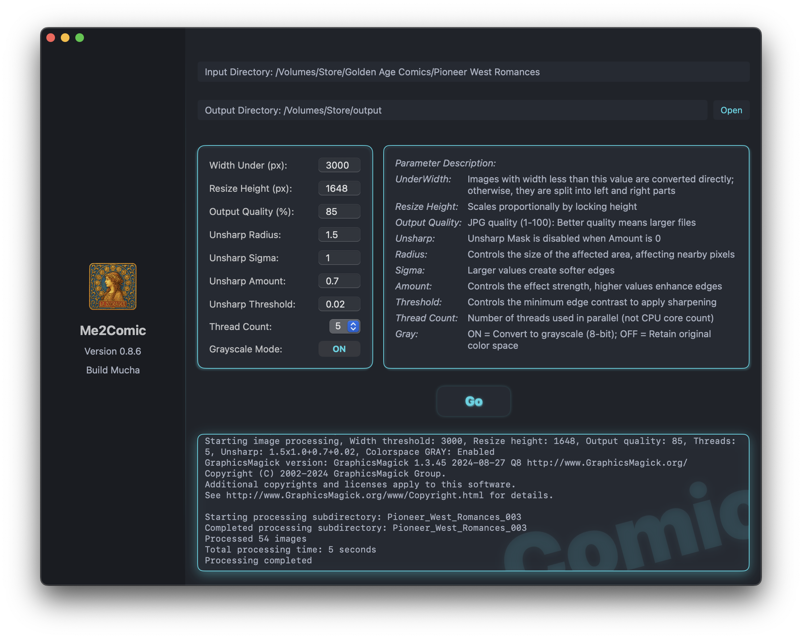

# Me2Comic

[](https://github.com/DawnLiExplorer/Me2Comic/actions/workflows/ci.yml)
[](https://opensource.org/licenses/MIT)

[English](../README.md) | [中文](README_zh.md) | [日本語](README_ja.md)

Me2Comic 是一款 macOS 下的 GUI 工具，通过调用 GraphicsMagick 实现图片的批量转换与裁切，在优先保证画质的前提下减小图片体积。作为一名漫画爱好者，我主要用它来处理漫画图片，同时借此学习 SwiftUI，积累更多经验。




## 主要功能

• 批量转换JPG/JPEG/PNG图片到JPG  
• 各项参数调节  
• 多线程  
• 自动裁切超设定阀值图片，均分为两个单页  
• 日志信息  

## 本地化

• 简体中文 | 繁體中文 | English | 日本語  

## 系统要求

macOs • 13.0+

## 安装依赖：

```shell
brew install graphicsmagick
```
## 目录结构示意图
### - 输入目录结构示意：

<pre>
/Volumes/漫画目录/待处理漫画目录/
├── CITY HUNTER Vol.xx
├── One Piece Vol.xx
└── 漫画3
</pre>

### - 完成后结构：

<pre>
/Volumes/漫画目录/搞完目录/
├── CITY HUNTER Vol.xx
│   ├── CITY.HUNTER.CE.1-1.jpg / CITY.HUNTER.CE.1-2.jpg (大于指定参数分切，右侧命名靠前)
│   └── CITY.HUNTER.CE.2...
├── One Piece Vol.xx
│   ├── One Piece Vol.1.jpg (小于指定参数不分切)
│   └── One Piece Vol.2...
└── 漫画3
</pre>

### <sub>※ *附注* </sub> 
<sub>※ *应用图标改编自穆夏《黄道十二宫》，版本代号致敬其艺术遗产，与官方项目无任何关联。* </sub>